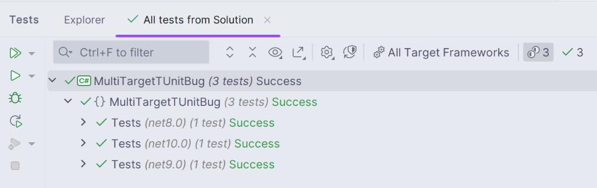
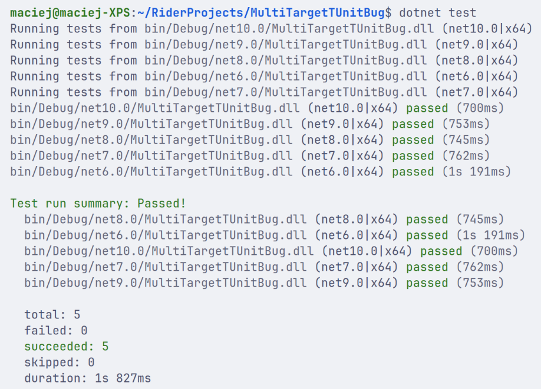

# Rider TUnit Multi-target Test Explorer bug
## [YouTrack issue](https://youtrack.jetbrains.com/issue/RIDER-132820/TUnit-tests-targeting-.NET-6-and-7-not-shown-in-Tests-window)
## Bug description
When the test project is set to target multiple .NET versions, the Test Explorer fails to display .NET 6 and .NET 7 tests. The tests are correctly identified and run using `dotnet test`.

### Rider test explorer view:

### `dotnet test` output:
